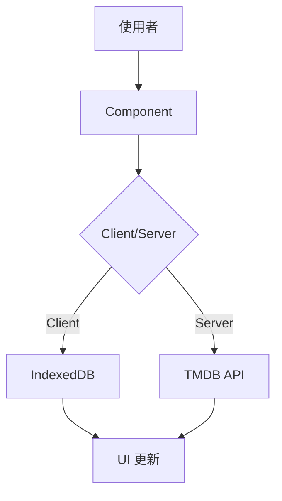
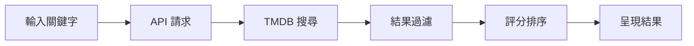

# Next.js TMDB 影視平台

基於 Next.js 15 打造的現代化影視串流應用

<div class="pt-12">
  <span @click="$slidev.nav.next" class="px-2 py-1 rounded cursor-pointer" hover="bg-white bg-opacity-10">
    開始介紹 →
  </span>
</div>

---
layout: two-cols
---

# 📋 產品概覽

一個功能完整的影視串流平台

::right::

<div class="mt-8">

### 🎯 核心功能

- 🎬 電影與劇集瀏覽
- 🔍 智能搜尋系統
- 📺 線上播放（HLS）
- ❤️ 收藏管理
- 📊 觀看進度追蹤
- 🎨 深色模式切換
- 📱 響應式設計

</div>

---

# 🎯 目標受眾

<div class="grid grid-cols-2 gap-8 mt-8">

<div>

## 產品亮點

- ✨ **極簡設計** - 直覺的使用介面
- 🚀 **流暢體驗** - Next.js 15 極速載入
- 📱 **跨裝置** - 手機、平板、桌面完美適配
- 💾 **本地儲存** - IndexedDB 離線數據持久化
- 🎨 **舒適觀看** - 深色/淺色模式自由切換

</div>

<div>

## 技術亮點

- ⚛️ **React 19** - 最新特性與 Hooks
- 🔄 **Next.js 15** - App Router + RSC
- 🎨 **Tailwind CSS 4** - 現代化樣式方案
- 📦 **TypeScript** - 完整型別安全
- 🗄️ **IndexedDB** - 客戶端數據管理

</div>

</div>

---
layout: two-cols
---

# 🛠️ 技術棧

### 核心框架

- **Next.js 15.5.4**
  - App Router
  - Server Components
  - Client Components
  - Dynamic Routes

- **React 19.1.0**
  - Hooks
  - Suspense
  - Error Boundaries

::right::

### UI & 樣式

- **Tailwind CSS 4**
  - 響應式設計
  - Dark Mode
  - 自定義動畫

- **Lucide React**
  - 現代化圖標庫

### 其他工具

- **TypeScript 5**
- **SweetAlert2** - 優雅提示
- **next-themes** - 主題管理

---

# 🏗️ 專案架構

<div class="grid grid-cols-2 gap-6">

<div>

### 📁 目錄結構

```
src/
├── app/                # App Router 頁面
│   ├── page.tsx       # 首頁
│   ├── search/        # 搜尋頁
│   ├── tmdb/          # TMDB 列表頁
│   └── trailer/       # 播放頁
├── components/        # React 元件
│   ├── VideoCard.tsx
│   ├── ScrollableRow.tsx
│   ├── PageLayout.tsx
│   └── ...
└── lib/              # 工具函數
    ├── db.client.ts  # IndexedDB
    ├── tmdb.client.ts # TMDB API
    └── types.ts      # 型別定義
```

</div>

<div>

### 🔄 資料流



</div>

</div>

---

# 💡 核心功能詳解

<div class="grid grid-cols-2 gap-8 mt-4">

<div>

### 1️⃣ 首頁展示

- **熱門電影** - 年度熱門（評分 > 6.6）
- **熱門劇集** - 年度熱門（評分 > 6.6）
- **繼續觀看** - 自動追蹤播放進度
- **智能過濾** - 自動篩選高分內容

```ts
// 評分過濾範例
const filteredMovies = movies.filter(
  movie => parseFloat(movie.rate) >= 6.6
);
```

</div>

<div>

### 2️⃣ 收藏系統

- **一鍵收藏** - 快速加入/移除收藏
- **本地儲存** - IndexedDB 持久化
- **實時同步** - 多頁面數據同步
- **觀看進度** - 記錄當前集數

```ts
// IndexedDB 訂閱機制
subscribeToDataUpdates(
  'favoritesUpdated',
  (newFavorites) => {
    updateFavoriteItems(newFavorites);
  }
);
```

</div>

</div>

---

# 🎨 海報展示

<div class="grid grid-cols-2 gap-6">

<div>

### 卡片設計

- **響應式海報** - 2:3 黃金比例
- **評分顯示** - 即時 TMDB 評分
- **載入優化** - 骨架屏 + 懶加載
- **互動回饋** - Hover 效果與動畫

### VideoCard 元件

```tsx
<VideoCard
  title="電影名稱"
  poster="海報URL"
  rate="8.5"
  year="2025"
  tmdb_id="12345"
  type="movie"
/>
```

</div>

<div>

### 展示模式

**ScrollableRow 橫向滾動**
- 平滑觸控滾動
- 自適應卡片寬度
- 支援鍵盤導航

**Grid 網格佈局**
- 手機：3 列
- 平板：4-5 列
- 桌面：6+ 列

```tsx
<div className="
  grid grid-cols-3
  sm:grid-cols-4
  lg:grid-cols-6
">
```

</div>

</div>

---

# 🎬 預告片播放

<div class="grid grid-cols-2 gap-6">

<div>

### YouTube 嵌入播放

- **TMDB API** - 獲取官方預告片
- **多預告支援** - 預告片/前導/花絮
- **自動播放** - YouTube iframe 嵌入
- **響應式播放器** - 適配各種螢幕

### 技術實現

```tsx
const getYouTubeEmbedUrl = (key: string) => {
  return `https://www.youtube.com/embed/${key}
    ?autoplay=1&rel=0&modestbranding=1`;
};

<iframe
  src={getYouTubeEmbedUrl(video.key)}
  allowFullScreen
/>
```

</div>

<div>

### 影片資料結構

```ts
interface TMDbVideo {
  key: string;          // YouTube 影片 ID
  name: string;         // 影片名稱
  type: string;         // Trailer/Teaser/Clip
  site: string;         // YouTube
  official: boolean;    // 是否官方
  published_at: string; // 發布時間
}
```

**功能特色**
- 多語言預告片切換
- 影片類型分類顯示
- 發布日期排序
- 官方認證標記

</div>

</div>

---

# 🔍 搜尋功能

<div class="mt-8">

### 智能搜尋系統

- 🔎 **實時搜尋** - 即時顯示結果
- 🎯 **多源整合** - TMDB API
- 📊 **結果排序** - 按相關度排序
- 🎭 **分類篩選** - 電影/劇集/演員

### 搜尋流程



</div>

---
layout: two-cols
---

# 🎨 UI/UX 設計

### 設計原則

<v-clicks>

- 🎯 **使用者優先** - 簡潔直覺的介面
- 📱 **移動優先** - Mobile First 設計
- ♿ **無障礙** - 符合 WCAG 標準
- ⚡ **性能優化** - 極速載入體驗

</v-clicks>

::right::

### 響應式設計

```css
/* Tailwind 響應式範例 */
<div className="
  grid
  grid-cols-3
  sm:grid-cols-4
  lg:grid-cols-6
  gap-4
">
```

- **手機** - 3 列卡片
- **平板** - 4 列卡片
- **桌面** - 6 列卡片

---

# 🌓 主題系統

<div class="grid grid-cols-2 gap-8">

<div>

### Dark/Light Mode

使用 `next-themes` 實現優雅的主題切換

```tsx
import { useTheme } from 'next-themes';

function ThemeToggle() {
  const { theme, setTheme } = useTheme();

  return (
    <button
      onClick={() =>
        setTheme(theme === 'dark'
          ? 'light'
          : 'dark'
        )
      }
    >
      切換主題
    </button>
  );
}
```

</div>

<div>

### 特色

- 🎨 **系統偏好** - 自動偵測系統主題
- 💾 **記憶選擇** - localStorage 持久化
- 🔄 **無閃爍** - SSR 友好的實現
- 🎭 **平滑過渡** - CSS transition 動畫

### Tailwind Dark Mode

```css
<div className="
  bg-white
  dark:bg-gray-900
  text-gray-900
  dark:text-white
">
```

</div>

</div>

---

# 💾 數據管理 - IndexedDB

<div class="grid grid-cols-2 gap-6">

<div>

### 為什麼選擇 IndexedDB？

- 📦 **大容量** - 遠超 localStorage（50MB+）
- 🔄 **非同步** - 不阻塞主執行緒
- 🗂️ **結構化** - 支援複雜資料結構
- 🔒 **同源策略** - 安全隔離

### 資料結構設計

```ts
interface FavoriteData {
  title: string;
  cover: string;
  total_episodes: number;
  save_time: number;
  source_name: string;
  year?: string;
}
```

</div>

<div>

### 核心 API

```ts
// 取得收藏
await getAllFavorites();

// 新增收藏
await saveFavorite(key, data);

// 移除收藏
await removeFavorite(key);

// 訂閱更新
subscribeToDataUpdates(
  'favoritesUpdated',
  callback
);
```

### 資料同步

- 多分頁實時同步
- 事件驅動更新
- 自動持久化

</div>

</div>

---

# ⚡ 性能優化

<div class="grid grid-cols-2 gap-8 mt-4">

<div>

### Next.js 優化

- **🎯 Server Components** - 減少 Client JS
- **📦 Code Splitting** - 動態載入
- **🖼️ Image Optimization** - 自動優化圖片
- **🔄 Streaming SSR** - 漸進式渲染

```tsx
// 動態載入
const VideoPlayer = dynamic(
  () => import('@/components/VideoPlayer'),
  { ssr: false }
);
```

</div>

<div>

### React 優化

- **⚛️ React.memo** - 避免無謂重渲染
- **🔄 useMemo/useCallback** - 記憶化
- **⏸️ Suspense** - 載入狀態管理
- **🎨 Skeleton Loading** - 優化載入體驗

```tsx
const MemoizedCard = memo(
  VideoCard,
  (prev, next) =>
    prev.id === next.id
);
```

</div>

</div>

---

# 🔐 型別安全 - TypeScript

<div class="grid grid-cols-2 gap-6">

<div>

### 完整型別定義

```ts
interface TMDbItem {
  id: string;
  title: string;
  poster: string;
  rate: string;
  year: string;
  overview?: string;
}

interface TMDbResponse {
  code: number;
  msg: string;
  list: TMDbItem[];
  total: number;
}
```

</div>

<div>

### 優勢

- ✅ **編譯時檢查** - 早期發現錯誤
- 🔍 **IDE 智能提示** - 提升開發效率
- 📚 **自文檔化** - 型別即文檔
- 🛡️ **重構安全** - 放心重構

```ts
// 型別推導範例
const [movies, setMovies] =
  useState<TMDbItem[]>([]);

// TypeScript 會自動檢查
setMovies([...]); // ✅
setMovies("error"); // ❌ 型別錯誤
```

</div>

</div>

---

# 📱 移動端體驗

<div class="grid grid-cols-2 gap-8">

<div>

### 移動端優化

- **📍 Bottom Navigation** - 底部導航列
- **👆 Touch Friendly** - 大按鈕、適當間距
- **↔️ 橫向滾動** - ScrollableRow 元件
- **🎯 Mobile Header** - 專屬移動端 Header

```tsx
<MobileBottomNav />
<MobileHeader />
```

</div>

<div>

### ScrollableRow 元件

```tsx
<ScrollableRow>
  {movies.map(movie => (
    <VideoCard
      key={movie.id}
      {...movie}
    />
  ))}
</ScrollableRow>
```

- 平滑滾動體驗
- 觸控手勢支援
- 自動計算寬度

</div>

</div>

---

# 🔍 程式碼亮點展示

### 1. Promise.all 並行請求優化

```tsx
const fetchTMDbData = async () => {
  setLoading(true);

  // ❌ 串行請求：總耗時 = 時間1 + 時間2（約 2-4 秒）
  // const moviesData = await getTMDbCategories({...});
  // const tvShowsData = await getTMDbCategories({...});

  // ✅ 並行請求：總耗時 = max(時間1, 時間2)（約 1-2 秒）
  const [moviesData, tvShowsData] = await Promise.all([
    getTMDbCategories({ kind: 'movie', category: '年度熱門' }),
    getTMDbCategories({ kind: 'tv', category: '年度熱門劇集' })
  ]);

  // 過濾低分內容
  const filteredMovies = moviesData.list.filter(
    movie => parseFloat(movie.rate) >= 6.6
  );
  setHotMovies(filteredMovies);
  setHotTvShows(tvShowsData.list.filter(show => parseFloat(show.rate) >= 6.6));
};
```

Promise.all 並行處理、效能優化、使用者體驗提升

---

# 🔍 程式碼亮點展示 (2)

### 2. 多層快取策略 + 過期機制

```tsx
// 快取資料結構：版本控制 + 時間戳
interface CacheData<T> {
  data: T;
  timestamp: number;  // 建立時間
  version: string;    // 快取版本
}

// 快取管理器
class HybridCacheManager {
  // 檢查快取是否過期（1小時）
  private isCacheValid<T>(cache: CacheData<T>): boolean {
    return cache.version === CACHE_VERSION &&
           Date.now() - cache.timestamp < 3600000;
  }

  // 讀取快取：先檢查記憶體 → 再檢查 localStorage → 最後請求 API
  getCachedFavorites(): Record<string, Favorite> | null {
    const cached = this.getUserCache(username).favorites;

    if (cached && this.isCacheValid(cached)) {
      return cached.data; // 命中快取，無需 API 請求
    }

    return null; // 快取過期，需重新獲取
  }
}
```

快取策略、過期機制、效能優化

---

# 🔍 程式碼亮點展示 (3)

### 3. 骨架屏載入優化

```tsx
{loading ? (
  // Skeleton Loading - 提升使用者體驗
  Array.from({ length: 8 }).map((_, index) => (
    <div key={index} className="min-w-[96px] w-24 sm:min-w-[180px] sm:w-44">
      <div className="relative aspect-[2/3] w-full overflow-hidden rounded-lg
                      bg-gray-200 animate-pulse dark:bg-gray-800">
        <div className="absolute inset-0 bg-gray-300 dark:bg-gray-700"></div>
      </div>
      <div className="mt-2 h-4 bg-gray-200 rounded animate-pulse"></div>
    </div>
  ))
) : (
  // 真實資料
  hotMovies.map(movie => <VideoCard {...movie} />)
)}
```

條件渲染、Tailwind 動畫、使用者體驗優化

---

# 🚀 專案特色總結

<div class="grid grid-cols-2 gap-8 mt-8">

<div>

### 🎯 產品層面

- ✨ 完整的影視串流功能
- 🎨 精緻的 UI/UX 設計
- 📱 全平台響應式適配
- ⚡ 極速載入體驗
- 💾 智能本地儲存

</div>

<div>

### 💻 技術層面

- ⚛️ React 19 最新特性
- 🔄 Next.js 15 App Router
- 📦 TypeScript 完整型別
- 🎨 Tailwind CSS 4
- 🗄️ IndexedDB 數據管理
- 🎬 HLS.js 串流技術

</div>

</div>

<div class="mt-12 text-center">

### 💡 這是一個展示現代前端技術棧的完整專案

結合了**產品思維**、**工程能力**與**技術深度**

</div>

---

# 謝謝觀看！

<div class="mt-8">

## 📚 專案資源

- 📂 GitHub Repository: `next-tmdb`
- 🚀 技術棧: Next.js 15 + React 19 + TypeScript
- 🎨 UI 框架: Tailwind CSS 4

</div>

<div class="mt-12 text-sm opacity-75">

使用 **Slidev** 製作 | Powered by Next.js & TMDB

</div>
